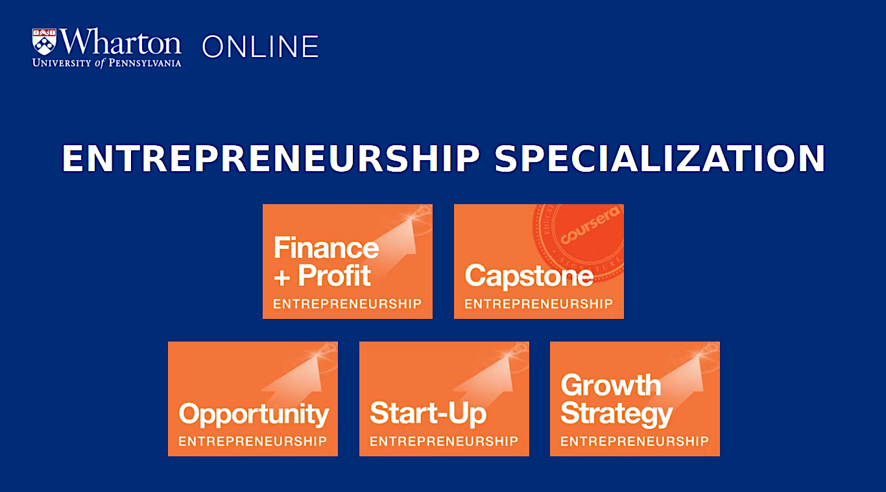

# Wharton Online Entrepreneurship Specialization (Coursera)

Welcome! This repository provides a comprehensive overview of the **Entrepreneurship Specialization** offered by the University of Pennsylvania Wharton School through the Coursera online learning platform.

---

## 📚 Overview

The Wharton Entrepreneurship Specialization is a five-course, beginner-friendly program that guides learners through the process of launching and growing a startup. Taught by renowned Wharton faculty, the specialization covers ideation, validation, launching, scaling, and financing new ventures.

- **Provider:** University of Pennsylvania (Wharton School)
- **Platform:** [Coursera](https://www.coursera.org/specializations/wharton-entrepreneurship)
- **Format:** 100% Online, Self-paced
- **Duration:** ~6 months (2 hours/week recommended)
- **Level:** Beginner (no prerequisites)
- **Certificate:** Yes (upon completion)

---

## 🏆 Who Should Enroll?

- Aspiring entrepreneurs and founders
- Innovators and intrapreneurs
- Business professionals and students
- Anyone interested in the startup process

---

## 🗂️ Specialization Structure

The specialization consists of **five sequential courses**:

| # | Course Title                                      | Focus Areas |
|---|---------------------------------------------------|-------------|
| 1 | **Developing the Opportunity**                    | Opportunity recognition, market analysis, customer discovery, ideation |
| 2 | **Launching Your Start-Up**                       | Lean startup, MVP, team building, pitching, legal basics |
| 3 | **Growth Strategies**                             | Scaling, customer acquisition, partnerships, growth models |
| 4 | **Financing and Profitability**                   | Funding sources, financial planning, profitability, exit strategies |
| 5 | **Wharton Entrepreneurship Capstone**             | Real-world project: business plan or investor pitch |

---

## 🎯 Learning Outcomes

- **Entrepreneurial Mindset:** Cultivate the skills and perspectives needed to identify and pursue new business opportunities.
- **Opportunity Assessment:** Evaluate ideas, analyze markets, and validate business concepts.
- **Startup Launch:** Apply lean startup principles, build teams, and navigate early-stage challenges.
- **Growth & Scaling:** Develop strategies for acquiring customers and scaling operations.
- **Startup Financing:** Understand funding options, financial management, and exit planning.
- **Capstone Project:** Synthesize your learning into a real-world business plan or pitch.

---

## 🛠️ Skills You Will Gain

- Business Model Development
- Market Analysis & Customer Insights
- Lean Startup & MVP Creation
- Team Building & Leadership
- Strategic Growth Planning
- Startup Financing & Profitability
- Pitching & Communication
- Innovation & Problem Solving

---

## 👨‍🏫 Instructors

Courses are taught by top Wharton faculty, including:

- Lori Rosenkopf
- Karl Ulrich
- Kartik Hosanagar
- David Hsu
- David Bell
- Laura Huang
- Ethan Mollick

---

## 🚀 How to Enroll

1. Visit the [Wharton Entrepreneurship Specialization on Coursera](https://www.coursera.org/specializations/wharton-entrepreneurship).
2. Click "Enroll" and choose your payment or financial aid option.
3. Start learning at your own pace!

---

## 🔗 Useful Links

- [Official Coursera Specialization Page](https://www.coursera.org/specializations/wharton-entrepreneurship)
- [Wharton School](https://online.wharton.upenn.edu/)
- [Coursera Financial Aid](https://www.coursera.support/s/article/209819033-Apply-for-Financial-Aid-or-a-Scholarship?language=en_US)

---

## 📜 License

This README is for informational purposes only and is not officially affiliated with the University of Pennsylvania or Coursera.

---

*Start your entrepreneurial journey with Wharton Online and Coursera – from idea to launch and beyond!*
